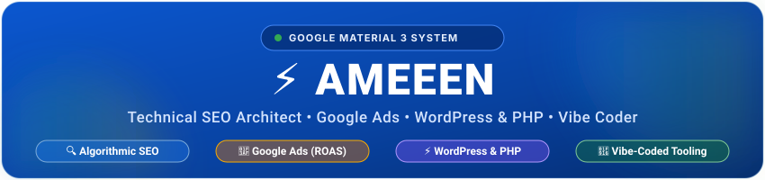
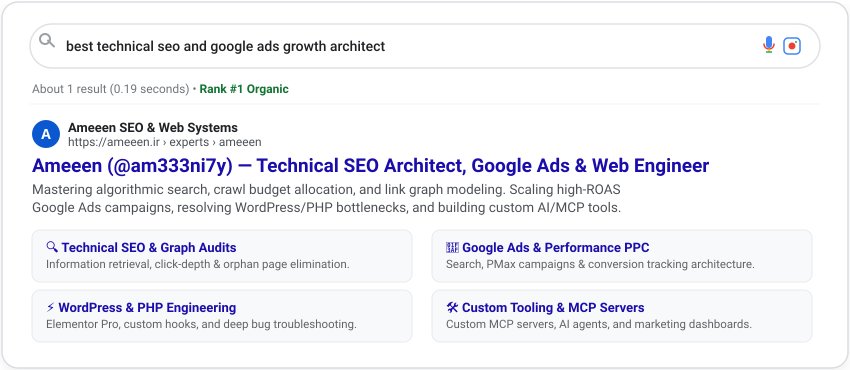
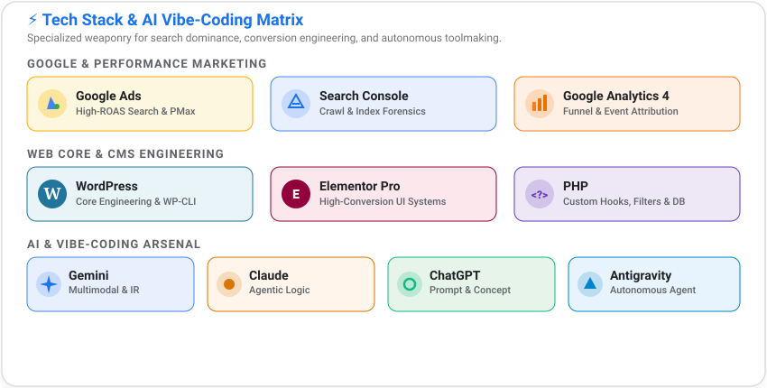
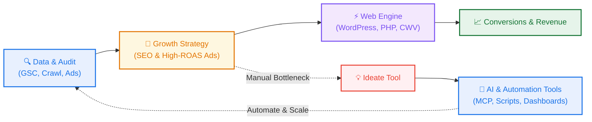

<!-- Self-Hosted Google Material 3 Header Banner (100% Reliable, Zero External Dependencies) -->

 

 

<!-- Material 3 Quick Action Chips -->

  

<!-- Dynamic Status Chips -->

---

### 🔍 Simulated Google SERP (Rank #1)

  

---

### 🌐 Overview & Philosophy

> **"I bridge the gap between search algorithms, paid acquisition, and rock-solid web infrastructure — powered by custom automation & toolmaking."**

Rather than treating digital marketing and web development as separate silos, I engineer them as a single cohesive growth engine:
- **Search Engines (SEO):** Deep understanding of information retrieval, internal link graphs, and crawl budget mechanics.
- **Paid Acquisition (Google Ads):** High-intent funnel design, Quality Score optimization, and reliable conversion measurement.
- **Web Infrastructure (WordPress & PHP):** Bespoke themes, clean PHP hooks, sub-second Core Web Vitals, and deep technical troubleshooting.
- **Custom Tooling & Automation:** Whenever I hit a manual bottleneck, I don't wait for third-party software. I architect the solution and engineer custom AI agents, MCP servers, and scripts to automate it.

---

### 🛠️ Specialized Arsenal & AI Stack

  

---

### 🧩 Core Pillars & Disciplines

<table>
  <tr>
    <td width="50%" valign="top">
      <h4>🔍 01. Technical & Algorithmic SEO</h4>
      <ul>
        <li><b>Information Retrieval:</b> Semantic topical authority, query-count HCU audits, and entity-first optimization.</li>
        <li><b>Crawl Architecture:</b> Link equity distribution, click-depth reduction, and orphan page eradication.</li>
        <li><b>Tools & Forensics:</b> Google Search Console, Screaming Frog, JSON-LD Schema, NetworkX graph modeling.</li>
      </ul>
    </td>
    <td width="50%" valign="top">
      <h4>🎯 02. Performance Marketing & Google Ads</h4>
      <ul>
        <li><b>Campaign Architecture:</b> High-intent Search campaigns, Performance Max (PMax), and Remarketing.</li>
        <li><b>Efficiency:</b> Quality Score engineering, negative keyword strategies, and smart bidding optimization.</li>
        <li><b>Tracking:</b> Google Tag Manager (GTM), GA4 event structures, Server-side tracking & CRO funnels.</li>
      </ul>
    </td>
  </tr>
  <tr>
    <td width="50%" valign="top">
      <h4>⚡ 03. WordPress, Elementor & PHP</h4>
      <ul>
        <li><b>Architecture:</b> Custom PHP hooks, filters, custom post types, and bespoke theme development.</li>
        <li><b>Design Systems:</b> High-converting, pixel-perfect Elementor Pro builds with clean, lightweight assets.</li>
        <li><b>Troubleshooting:</b> Debugging complex PHP/SQL errors, plugin conflicts, and Core Web Vitals (LCP/INP) tuning.</li>
      </ul>
    </td>
    <td width="50%" valign="top">
      <h4>🤖 04. Custom Tooling & AI Automation</h4>
      <ul>
        <li><b>Ideation to Reality:</b> Conceptualizing automation workflows and building them fast with AI agents.</li>
        <li><b>Agentic Tooling:</b> Custom Model Context Protocol (MCP) servers connecting CMSs to LLMs.</li>
        <li><b>Dashboards:</b> Contributor to multi-brand marketing dashboards and data visualization tools.</li>
      </ul>
    </td>
  </tr>
</table>

---

### 🛠️ In-House Tools & Automation Projects

When existing marketing tools are bloated or missing critical features, I architect and build my own solutions:

<table>
  <thead>
    <tr>
      <th>Project</th>
      <th>Concept & Solution</th>
      <th>Primary Stack</th>
      <th>Repository</th>
    </tr>
  </thead>
  <tbody>
    <tr>
      <td>🔌 <b>wordpress-mcp</b></td>
      <td>Dual-engine Model Context Protocol (MCP) server connecting WordPress to AI agents (Claude, Cursor, Antigravity) via REST API & WP-CLI.</td>
      <td><code>TypeScript</code> <code>MCP</code> <code>WP-CLI</code></td>
      <td><a href="https://github.com/am333ni7y/wordpress-mcp">View Repo</a></td>
    </tr>
    <tr>
      <td>🕸️ <b>site-pages-graph</b></td>
      <td>Interactive Technical SEO site architecture visualizer, internal link graph mapper, and click-depth auditor.</td>
      <td><code>Python</code> <code>Graph Analysis</code></td>
      <td><a href="https://github.com/am333ni7y/site-pages-graph">View Repo</a></td>
    </tr>
    <tr>
      <td>🔍 <b>internal-link-auditor</b></td>
      <td>Asynchronous link graph visualizer and orphan page auditor to streamline crawl efficiency.</td>
      <td><code>Python</code> <code>AsyncIO</code></td>
      <td><a href="https://github.com/am333ni7y/internal-link-graph-auditor">View Repo</a></td>
    </tr>
    <tr>
      <td>💬 <b>teleconnect-wordpress</b></td>
      <td>Direct WordPress customer engagement bridge routing live site inquiries into Telegram.</td>
      <td><code>JavaScript</code> <code>WordPress</code></td>
      <td><a href="https://github.com/am333ni7y/teleconnect-telegram-livechat-wordpress">View Repo</a></td>
    </tr>
    <tr>
      <td>📊 <b>Marketing Dashboards</b></td>
      <td>Contributor to multi-brand marketing dashboards, performance analytics pipelines, and web app troubleshooting.</td>
      <td><code>Collaborator</code> <code>Web Apps</code></td>
      <td><i>Active Work</i></td>
    </tr>
  </tbody>
</table>

---

### 🔄 The Growth & Automation Loop

How strategy, execution, and custom automation feed into each other:

---

### 🤝 Let's Connect & Build

Looking for high-impact Technical SEO, data-driven Google Ads scaling, or deep WordPress & PHP troubleshooting?

 

  

  Designed with Material 3 Principles &bull; Crafted by Ameeen &bull; 100% Self-Hosted Assets

