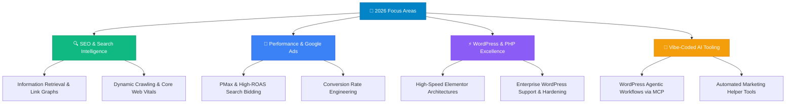

<div align="center">


# ⚡ Ameeen (@am333ni7y)

**SEO Architect &bull; Performance Marketer &bull; WordPress & PHP Specialist &bull; Creative Vibe Coder**  
*Turning Search Engines into Fans · Scaling Google Ads ROAS · Rock-Solid WordPress Infrastructure*

<a href="https://github.com/am333ni7y">
  
</a>

<br>

[](https://ameeen.ir)
[](https://twitter.com/ameeen_DM)
[](https://github.com/am333ni7y)

<br>


</div>

---

<div align="center">

### 🧭 Quick Navigation

[👋 About Me](#-about-me) · [🎯 Primary Arsenal](#-primary-arsenal--expertise) · [🧪 The Vibe-Code Lab](#-the-vibe-code-lab--fun-tools) · [🗺️ 2026 Roadmap](#️-2026-roadmap) · [📊 GitHub Stats](#-github-stats) · [🤝 Connect](#-lets-collaborate)

</div>

---

<div align="center">

</div>

## 👋 About Me

```typescript
const ameeen = {
  identity:  "Digital Growth Strategist & WordPress Engineer with a Vibe-Coding Superpower",
  location:  "🌍 Middle East · Open to Worldwide Collaborations",
  
  what_i_master: [
    "🔍 Technical & Algorithmic SEO (Information Retrieval, crawl architecture, click depth)",
    "🎯 Google Ads & Performance Marketing (High-intent campaigns, ROAS scaling, CRO funnels)",
    "⚡ WordPress, Elementor Pro & PHP (Theme/plugin architecture, core troubleshooting, speed tuning)",
  ],

  how_i_build_tools: 
    "I ideate the tools I need to break bottlenecks, then vibe-code them into reality using AI & modern runtimes.",

  motto: "If it drives traffic, converts customers, or runs 10x faster — count me in.",
};
```

> 💡 **The Vibe-Coder Mindset:** I'm not a traditional software dev grinding leetcode. I am a marketer and web specialist who understands what modern businesses actually need. When an off-the-shelf tool doesn't exist, I architect the concept and vibe-code custom AI tools, MCP servers, and scripts to get the job done.

---

<div align="center">

</div>

## 🎯 Primary Arsenal & Expertise

### 🔍 1. Technical & Algorithmic SEO
- **Search Architecture:** Information retrieval fundamentals, crawl budget allocation, site click-depth modeling.
- **Auditing & Forensics:** Internal link graph analysis, orphan page elimination, Core Web Vitals optimization.
- **Search Stack:** Google Search Console, Google Analytics 4, Screaming Frog, JSON-LD Schema.

### 🎯 2. Performance Marketing & Google Ads
- **Paid Acquisition:** High-intent Google Search campaigns, Display, Performance Max (PMax).
- **Optimization:** Quality Score engineering, smart bidding strategies, audience segmentation.
- **Conversion Tracking:** Google Tag Manager (GTM), GA4 event architectures, conversion rate optimization (CRO).

### ⚡ 3. WordPress, Elementor Pro & PHP Engineering
- **Custom Development:** Advanced PHP hooks/filters, custom post types, bespoke themes and functional extensions.
- **Visual Engineering:** Pixel-perfect, responsive layouts with Elementor Pro — clean, lightweight, and conversion-focused.
- **Support & Troubleshooting:** Resolving tricky PHP/database errors, plugin conflicts, speed bottlenecks, and security hardening.

---

<div align="center">

</div>

## 🧪 The Vibe-Code Lab & Fun Tools

> *Whenever I hit a manual bottleneck in marketing or CMS management, I dream up a tool and vibe-code it using AI agents, MCP, and scripts.*

| Project / Tool | What It Does & Why I Built It | Stack / Vibe | Link |
|---|---|---|---|
| 🔌 **wordpress-mcp** | A custom Model Context Protocol (MCP) server letting AI agents (Claude, Cursor, Antigravity) manage WordPress via REST API & WP-CLI. | `TypeScript` · `MCP` · `AI Agents` | [Repo](https://github.com/am333ni7y/wordpress-mcp) |
| 🕸️ **site-pages-graph** | An interactive tool that visually maps site architecture and click-depth to uncover link equity leaks. | `Python` · `Graph Analysis` | [Repo](https://github.com/am333ni7y/site-pages-graph) |
| 🔍 **internal-link-auditor** | Async link crawler to find orphan pages and optimize internal link distribution effortlessly. | `Python` · `AsyncIO` | [Repo](https://github.com/am333ni7y/internal-link-graph-auditor) |
| 💬 **teleconnect-wordpress** | A fun live chat tool bridging WordPress user conversations directly with Telegram. | `JavaScript` · `WordPress` | [Repo](https://github.com/am333ni7y/teleconnect-telegram-livechat-wordpress) |
| 📊 **Marketing Dashboards** | Contributor to multi-brand marketing dashboards, performance analytics, and web app workflows. | `Collaborator` · `Next.js / Web Apps` | *Active* |

---

<div align="center">

</div>

## 🗺️ 2026 Roadmap



---

<div align="center">

</div>

## 📊 GitHub Stats

<div align="center">


<br>


<br>


</div>

---

<div align="center">


<br>

### 🌟 *"Rank higher, convert faster, and let AI-assisted tools handle the repetitive stuff."*

<br>

### 🤝 Let's Collaborate

Got an ambitious SEO challenge, looking to scale your Google Ads, or need expert WordPress & PHP support?

[](https://ameeen.ir)
[](https://twitter.com/ameeen_DM)
[](https://github.com/am333ni7y)

<br>


**⚡ AMEEEN &bull; [ameeen.ir](https://ameeen.ir)**


</div>
